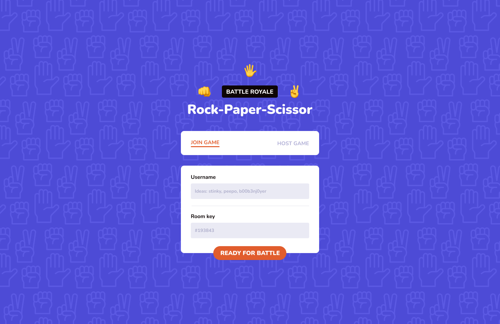
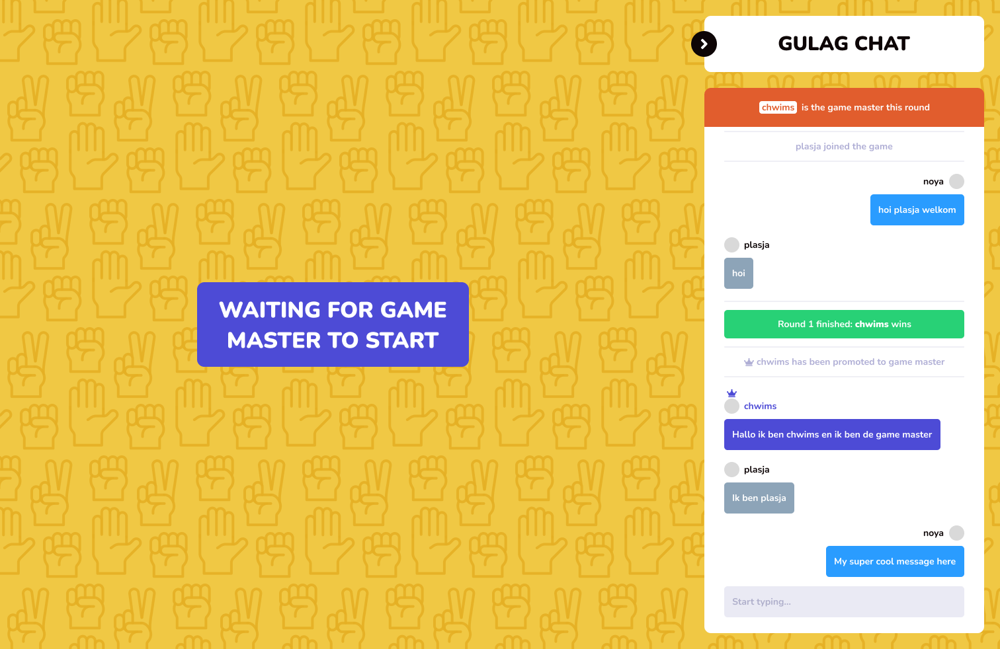
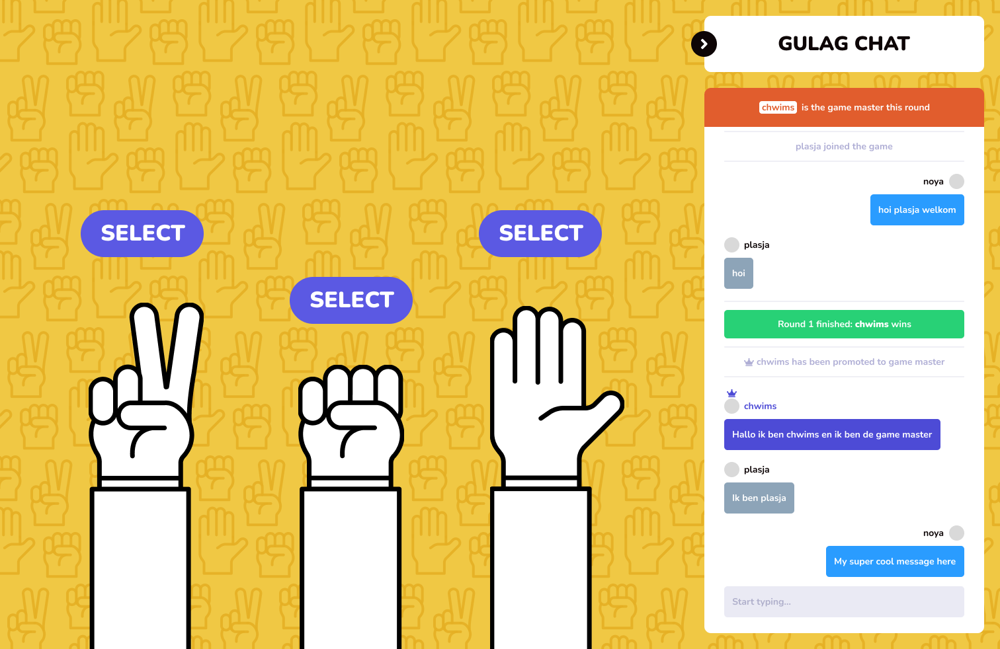
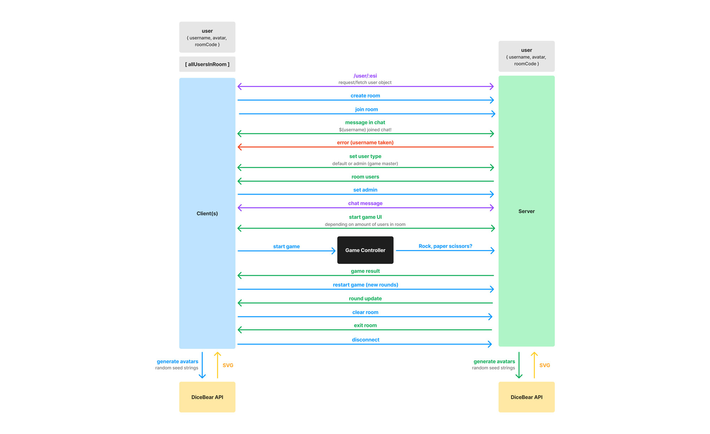

# BR: Rock-Paper-Scissors - Documentation

For the course "Real-Time Web" everyone was tasked to design and build a Real-Time web application (obiously) based on your own concept. The teachers gave us about three weeks for this assignment. 

## Brainstorming

About a week before the course actually started I went ahead and looked into what would be expected of me during this course. I read the different assignments and noticed we would be spending time creating a real-time web application based on one of our own personal concepts.

I was quick to think of two ideas that could be ambitious if put in some extra effort but also managable within a span of three weeks:

- Multiplayer typeracer (something like [monkeytype](https://monkeytype.com/))
- Multiplayer/Battle Royale rock, paper, scissors

I am a big fan of custom keyboards, and therefore automatically love doing little speed typing tests with friends. There are sites out there like [monkeytype](https://monkeytype.com/) or [typeracer](https://typeracer.com/), but I felt like it would be fun to create my own app for it which also included some form of a chat room. This could have been a fun project, but I think I would have gotten sucked into the technical aspect of the game itself rather than the real focus of this course.

Therefore, the rock, paper scissors game sounded a bit more managable, and it would be something I can always expand on by adding extra features (basically, the main difference between the two ideas is that the typeracer has a bigger/more difficult core functionality compared to the RPS game). Not only am I a big fan of custom keyboards, I am also a fan of movies! As any other movie enjoyer, I liked The Hunger Games a lot. You could say it is basically a Battle Royale movie. You enter an arena and fight for survival; last one standing wins. This is the type of energy I wanted to go for with my rock, paper, scissors game. 

## Concept

Like I said, enter an arena and fight for survival. That's the main goal of this game: win a round of rock, paper, scissors! Except, instead of playing 1-on-1, you're playing against 5 other people at the same time, virtually.

The idea is fairly simple. Just like in The Hunger Games, there is a Game Master. The Game Master (at first) is the player who created the room. After room creation, they can then share the room key with others. Upon entering the game room, users can chat with each other in real-time thanks to the socket connection.

To start the first game session, The Game Master will have to select up to five other players to play with and against (may the odds be ever in your favor!). During the first round, each player will receive one of the following power-up:

- A gun: beats paper and scissors and loses to rock
- A shield: blocks any life-threatening attack (for example: if you picked paper and your opponent rock, the shield will keep you alive for another round)
- Reverse: switch your selected choice with that of your opponent (would only work in 1v1)
- Revival: bring an eliminated player back to life

The last player standing wins the first session and automatically makes them the new Game Master. The game and this cycle basically continues until a player gets crowned as Apex Predator (wink Apex Legends inspo) by reaching 3 total wins.

## Features

Based on the concept brief above, I was able to create a list of must-have requirements:

- User must be able to create a game room
- User must be able to share a room key
- User must be able to enter a game room via room key
- User must be able to pick a username
- User must be able to chat with other players
- System must be able to assign random avatar icons for each new user
- Admin user (game master) must be able to select a group of players to start the game
- User must be able to play rock, paper, scissors

Some additional requirements that I could think of with less priority than the requirements above:

- System provides power-up to users during certain rounds
- Users must be able to equip power-ups
- Admin must be able to end the entire session for everyone
- Admin must be able to restart the session for everyone

## Design
After creating a concept and defining a list of requirements I went on to design the interface. I only focused on the onboarding screen and the general look and feel, including some components. I did not want to spend too much time on creating a design, since I knew the development part would require a lot of my time and energy. Below you can see an overview of the designs I created. 





## Development reflection
I wouldn't say it was my first time working with sockets, but it was definitely my first time implementing it all by myself from scratch. I already knew the concept and how it worked thanks to work experience, but I had never implemented it myself! So, I was excited to get started.

I think throughout the first week I mostly focused on getting an onboarding screen and chat screen going. Along side this chat, I wanted to allow users to create usernames. One of the issues I came across was navigating between multiple pages and pass along data without using a database. My solution was to submit the form data (which in my case just included a username) and save said data in my server session storage (Express session). As the user gets through the onboarding, and enters the chatroom, via a simple fetch I pass along the data from the express session and use that data to join a socket!

After I figured out how to create rooms and maintain user data, I moved on to fixing the Rock, Paper, Scissors mechanics. Unfortunately I was only able to work on this during the final week of this course, meaning it feels a bit rushed and the UI is not the way I imagined it to be. A lot of my time went into the socket functionalities (room creation, maintaining data, creating message handlers etc etc). But it works! Rock, Paper, Scissors is a fairly easy game and concept to code:

```js
if (player1Choice === player2Choice) {
    return 'tie';
} else if (
    (player1Choice === "rock" && player2Choice === "scissors") ||
    (player1Choice === "paper" && player2Choice === "rock") ||
    (player1Choice === "scissors" && player2Choice === "paper")
) {
    return { winner: player1, loser: player2 };
} else {
    return { winner: player2, loser: player1 };
}
```

Due to time shortage I was also unable to add something proper for when a user disconnects for a certain amount of time and then reconnects (tunnel example!). I did implement some disconnect functionalities, however this functionality basically checks within a timeout if it was a quick disconnect (refreshing of page) or an actual disconnect. The actual disconnect would delete the user (and room if needed), but this means that when a user were to lose connection, they would also be deleted. I'm fully aware that this isn't ideal, but like I said before, I unfortunately did not have enough time to fix this.

## Data Life Cycle

To better understand what it is I created and how it works, I created a Data Life Cycle diagram! 

> A data life cycle diagram is a visual representation that illustrates the stages and flow of data throughout its entire lifespan within the system.

The life cycle of my system starts at the onboarding screen. A user either creates or joins a room! The client and server both store an object containing user data (username, DiceBear API url for avatar, room code and admin status). Within the lobby of the game this user data gets passed between each other my a request/fetch to `/user/:esi`. After a user has successfully created or joined a room, other users in the room will get a message in chat from the system stating that a new user joined. 

On room join, the server determines whether or not the user will be the game master or not (admin user). Being a game master means you have the 'power' to control the game. If you're eligible to be an admin, the client will perform a POST fetch to the server so that this admin status can also be saved on server storage. On room join the server also sends back a list of all users in said room, including their admin status. Of course, after joining a room, the user will be able to send messages to other users within the room. Based on who sent the message, the UI will look different. Your own messages are displayed on the right side of the chat, whereas incoming messages are displayed on the left side. Game masters will have an additional crown above their username!

Whenever a client joins a room, the server checks whether or not there are enough players to start a game. If there are 2 users within a room, the server will trigger an event to start up the game UI for the game master. The game master can then decide when to start the game and who to fight. As the game starts, the Game Controller takes over. Within the Game Controller different UI components get triggered to receive data. When it has received data (aka timer ran out and Rock, Paper, Scissors choices were made), the Game Controller will emit an event to process the data. Within the server the data gets checked and eventually determined who wins. The results of each round then get passed back to the client. Until there's a user with 3 wins, this cycle/these events will continue! 

If there's a user with 3 wins, the game will prompt the game master to either restart the game or end the session (for all). Restarting the game would result into the rounds and leaderboard being reset, and the end session would do exactly as intended (ends the session!).

And that's how my little system works :D

